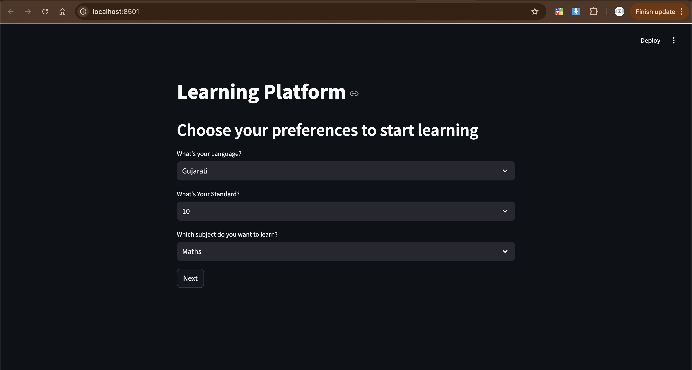

# **Student Super Power: Personalized Learning Platform**



## **Project Overview**

**Student Super Power** is a personalized learning platform designed to address the educational gap by providing scalable, tailored learning experiences for K-12 students. Through AI-powered tools, the platform adapts to each student's unique learning style, enhancing educational access and effectiveness.

### **Mission**
To deploy an AI-driven platform that provides chapter-focused, personalized learning, adapting to each student’s needs and pace.

---

## **Technology Stack**

* **Frontend:** Streamlit
* **Backend:** Python Flask
* **AI Models:** OpenAI GPT-4, Google Gemini 2.5
* **AI Agents:** Crew AI (managing To-Know, Learning Tracker, Roadmap, Tutor, and Practice Agents)

---

## **Project Architecture**

**AI Agents** orchestrated by Crew AI:

1. **To-Know Agent:** Gathers student learning styles, preferences, strengths, and interests to create a detailed student profile.
2. **Learning Tracker Agent:** Tracks understanding via quizzes, establishing a Learning Score (LS).
3. **Roadmap Agent:** Develops a personalized learning map with resources.
4. **Tutor Agent:** Provides guidance based on the learning roadmap.
5. **Practice Agent:** Supplies practice tasks, updates LS, and tracks learning progress.

## **Installation and Setup**

### **1. Prerequisites**
- **Python:** 3.9+
- **API Keys:** OpenAI GPT-4 and Google Gemini 2.5 API keys (store as `GEMINI_API_KEY`, `OPENAI_API_KEY`)

### **2. Installation**

#### **Clone the Repository**
```bash
git clone https://github.com/chiragjoshi12/Student-Super-Power.git
cd Student-Super-Power
```

#### **Backend Setup**
```
cd backend
pip install -r requirements.txt
export GEMINI_API_KEY=your_gemini_key
export OPENAI_API_KEY=your_openai_key
python app.py
```

#### **Backend Setup**
```
cd frontend
pip install -r requirements.txt
streamlit run main.py
```

## How to Use
1. Run the Backend: `python app.py` (from the backend folder)
2. Run the Frontend: `streamlit run main.py` (from the frontend folder)
3. Access the Platform: Open the local `Streamlit URL` to interact with the platform.
